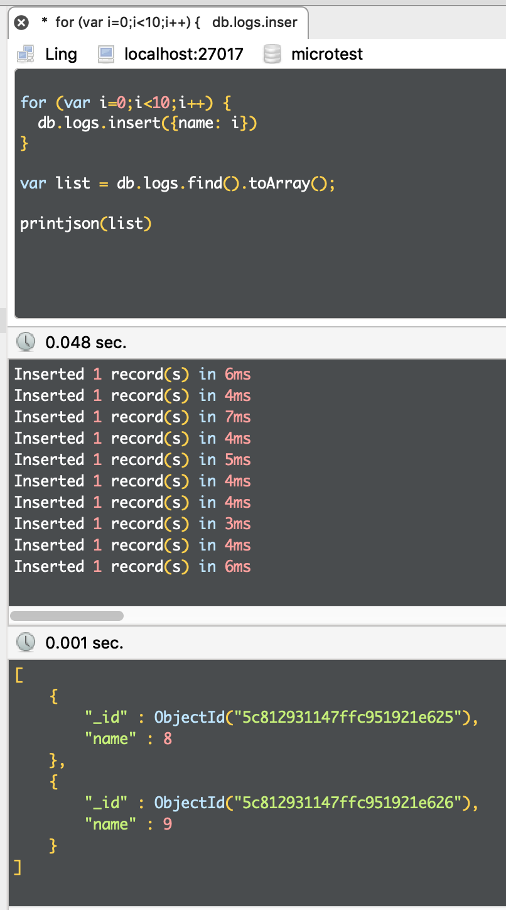

### [Introduction to MongoDB](https://docs.mongodb.com/manual/introduction/)

### 使用 Docker 一秒本地搭建 Mongodb  & mongo-express 环境

编辑 docker-compose.yml
```sh
vim docker-compose.yml
```
```yml
version: '3.1'

services:

  mongo:
    image: mongo:4.0.6
    restart: always
    volumes:
      - ./data:/data/db
    environment:
      MONGO_INITDB_ROOT_USERNAME: root
      MONGO_INITDB_ROOT_PASSWORD: 123456

  mongo-express:
    image: mongo-express
    restart: always
    ports:
      - 8081:8081
    environment:
      ME_CONFIG_MONGODB_ADMINUSERNAME: root
      ME_CONFIG_MONGODB_ADMINPASSWORD: 123456
```

启动
```sh
docker-compose up -d
```

进入 mongo-express，[http://localhost:8081](http://localhost:8081)，对 database 进行一系列的操作（安全，无需提供远程访问）

[Robomongo](https://github.com/Studio3T/robomongo)，外部管理。(可视化的操作配合官方手册，学起来事半功倍)


### [Databases and Collections](https://docs.mongodb.com/manual/core/databases-and-collections/)

Databases：In MongoDB, **databases hold collections of documents.**


### [Capped Collections](https://docs.mongodb.com/manual/core/capped-collections/) 
上限集合，想象成一个固定的循环队列

一个集合，它可以做到 size 的上限和 document 个数的上限

```sh
var mydb = db.createCollection("mytest")
printjson(mydb);
# {"ok":1}
```


```sh
for (var i=0;i<10;i++) {
  db.logs.insert({name: i})
}
var list = db.logs.find().toArray();
printjson(list)
```



**可以查看 [db.createCollection()](https://docs.mongodb.com/manual/reference/method/db.createCollection/#db.createCollection)，使用代码创建**


### [Documents](https://docs.mongodb.com/manual/core/document/)


