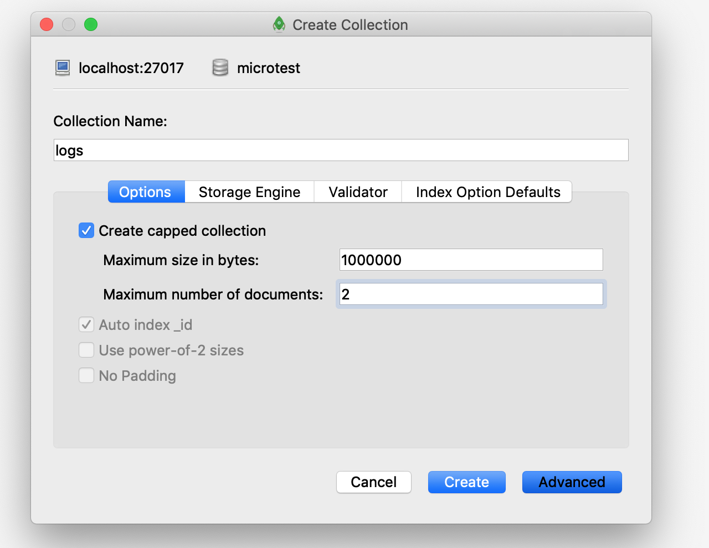

### [Introduction to MongoDB](https://docs.mongodb.com/manual/introduction/)

### 使用 Docker 一秒本地搭建 Mongodb  & mongo-express 环境

编辑 docker-compose.yml
```sh
vim docker-compose.yml
```
```yml
version: '3.1'

services:

  mongo:
    image: mongo:4.0.6
    restart: always
    volumes:
      - ./data:/data/db
    environment:
      MONGO_INITDB_ROOT_USERNAME: root
      MONGO_INITDB_ROOT_PASSWORD: 123456

  mongo-express:
    image: mongo-express
    restart: always
    ports:
      - 8081:8081
    environment:
      ME_CONFIG_MONGODB_ADMINUSERNAME: root
      ME_CONFIG_MONGODB_ADMINPASSWORD: 123456
```

启动
```sh
docker-compose up -d
```

进入 mongo-express，[http://localhost:8081](http://localhost:8081)，对 database 进行一系列的操作（安全，无需提供远程访问）

[Robomongo](https://github.com/Studio3T/robomongo)，外部管理。(可视化的操作配合官方手册，学起来事半功倍)


### [Databases and Collections](https://docs.mongodb.com/manual/core/databases-and-collections/)

Databases：In MongoDB, **databases hold collections of documents.**


### [Capped Collections](https://docs.mongodb.com/manual/core/capped-collections/) 
上限集合，想象成一个固定的循环队列的模式(适合做日志存储，新的进来，老的出去)

一个集合，它可以做到 size 的上限和 document 个数的上限

```sh
var mydb = db.createCollection("mytest")
printjson(mydb);
# {"ok":1}
```



```sh
for (var i=0;i<10;i++) {
  db.logs.insert({name: i})
}
var list = db.logs.find().toArray();
printjson(list)
```


**可以查看 [db.createCollection()](https://docs.mongodb.com/manual/reference/method/db.createCollection/#db.createCollection)，使用代码创建**

```sh
db.createCollection("mylog", { capped: true, size: 5242880, max: 5000 })
```

* 对照文档实验
  * [Query a Capped Collection](https://docs.mongodb.com/manual/core/capped-collections/#query-a-capped-collection)
  * [Check if a Collection is Capped](https://docs.mongodb.com/manual/core/capped-collections/#check-if-a-collection-is-capped)
  * [Convert a Collection to Capped](https://docs.mongodb.com/manual/core/capped-collections/#check-if-a-collection-is-capped)

### [Documents](https://docs.mongodb.com/manual/core/document/)


### [BSON Types](https://docs.mongodb.com/manual/reference/bson-types/)

Double, String, Object, Array, Binary data, Undefined, ObjectId, Boolean, Date, Null, Regular Expression, DBPointer, JavaScript, Symbol, JavaScript (with scope)	, 32-bit integer, Timestamp, 64-bit integer, Decimal128, Min key, Max key

[$type](https://docs.mongodb.com/manual/reference/operator/query/type/#op._S_type)  应用之查询 `Undefined` 类型

```sh
printjson(db.mycollection.find({name:undefined}).toArray()); # 报错，cannot compare to undefined
printjson(db.mycollection.find({name:{$type:6}}).toArray()); # OK
printjson(db.mycollection.find({name:{$type: "undefined"}}).toArray()); # OK

db.mycollection.insert({name:/d+/}) # 插入正则
db.mycollection.insert({name:function(){}})  # 插入javascript
```

**[ObjectId()](https://docs.mongodb.com/manual/reference/method/ObjectId/index.html)**

无索引的情况下，我们的数据叫做heap。有了主键索引，那么就是一个BTree。

```sh
ObjectId() # 每次执行，它都会变
# ObjectId("5c8261d3147ffc951921e62a") 
```

Returns a new ObjectId value. The 12-byte ObjectId value consists of:
* a 4-byte value representing the seconds since the Unix epoch,
* a 5-byte random value, and
* a 3-byte counter, starting with a random value.

通过上面的这种方式来将 ObjectId 做到全局唯一。

### [The mongo Shell](https://docs.mongodb.com/manual/mongo/#the-mongo-shell)

The mongo shell is an interactive JavaScript interface to MongoDB. 

它包裹了一个 Javascript V8 引擎

什么命令都可以不学，进人 shell 先打 help 

```sh
mongo -u root -p 123456
help
#	db.help()                    help on db methods
#	db.mycoll.help()             help on collection methods
#	sh.help()                    sharding helpers
#	rs.help()                    replica set helpers
#	help admin                   administrative help
#	help connect                 connecting to a db help
#	help keys                    key shortcuts
#	help misc                    misc things to know
#	help mr                      mapreduce

#	show dbs                     show database names
#	show collections             show collections in current database
#	show users                   show users in current database
#	show profile                 show most recent system.profile entries with time >= 1ms
#	show logs                    show the accessible logger names
#	show log [name]              prints out the last segment of log in memory, 'global' is default
#	use <db_name>                set current database
#	db.foo.find()                list objects in collection foo
#	db.foo.find( { a : 1 } )     list objects in foo where a == 1
#	it                           result of the last line evaluated; use to further iterate
#	DBQuery.shellBatchSize = x   set default number of items to display on shell
#	exit                         quit the mongo shell

show dbs
db
use microtest
show collections
load("/root/demo.js") # 直接加载一个 js 文件写非常复杂的语句
# var mongo=new Mongo("192.168.161.136:27017")
# var db=mongo.getDB("datamip")
# var collection=db.getCollection("person")
# var list = collection.find().toArray();
# printjson(list);

cls # 清屏
db.help() # 要善用 help
```

### [SQL to MongoDB Mapping Chart](https://docs.mongodb.com/manual/reference/sql-comparison/)

